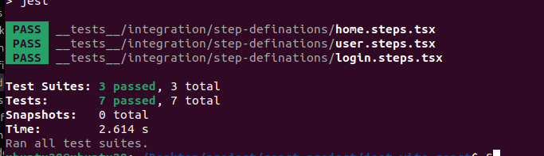

# Jest, `jest-cucumber`, and React Testing Library Setup

This project is configured to use Jest for unit testing, `jest-cucumber` for BDD-style testing, React Testing Library for testing React components, and React Query for data fetching. This README provides details on how to use these tools and the rationale behind testing.

## Table of Contents

1. [Project Overview](#project-overview)
2. [Testing Libraries](#testing-libraries)
   - [Jest](#jest)
   - [`jest-cucumber`](#jest-cucumber)
   - [React Testing Library](#react-testing-library)
3. [Why Testing is Important](#why-testing-is-important)
4. [The Testing Pyramid](#the-testing-pyramid)
5. [Project Structure](#project-structure)
6. [Running Tests](#running-tests)
7. [Test Results](#test-results)
8. [Additional Information](#additional-information)

## Project Overview

This project uses the following testing tools:

- **Jest**: A JavaScript testing framework with a test runner and assertion library.
- **`jest-cucumber`**: Integrates Cucumber's BDD syntax with Jest for writing clear, descriptive tests.
- **React Testing Library**: Provides utilities for testing React components from the user's perspective.
- **React Query**: Manages server state and caching with hooks for data fetching.

## Testing Libraries

### Jest

[Jest](https://jestjs.io/) is a powerful JavaScript testing framework that includes a test runner, assertion library, and mocking capabilities. It supports:

- **Snapshot Testing**: Capture and compare the rendered output of components.
- **Mocking**: Mock functions, modules, and timers to isolate tests and simulate different scenarios.
- **Parallel Testing**: Run tests in parallel to speed up the testing process.
- **Code Coverage**: Measure the percentage of code covered by tests.

Jest is particularly useful for its ease of setup, built-in features, and comprehensive documentation.

### `jest-cucumber`

[`jest-cucumber`](https://github.com/jest-community/jest-cucumber) combines Cucumber's BDD (Behavior-Driven Development) syntax with Jest, allowing tests to be written in a natural language format (Given, When, Then). This approach:

- **Improves Clarity**: Makes tests more readable and understandable by describing scenarios in plain English.
- **Facilitates Collaboration**: Helps non-technical stakeholders understand and contribute to test scenarios.
- **Supports Behavior Testing**: Focuses on the behavior of the application from the user's perspective.

### React Testing Library

[React Testing Library](https://testing-library.com/docs/react-testing-library/intro) is a library for testing React components by focusing on their behavior and interaction with users. It provides utilities to:

- **Render Components**: Render React components into a testable DOM.
- **Query Elements**: Query elements in the DOM in ways that resemble how users would interact with them (e.g., `getByText`, `getByRole`).
- **Simulate User Interactions**: Simulate user interactions like clicks, typing, and more with `user-event`.

**Why Use React Testing Library?**

- **Focus on User Interaction**: React Testing Library encourages tests that simulate how users interact with your application, leading to more meaningful tests.
- **Avoid Implementation Details**: It promotes testing components from the user's perspective rather than focusing on internal implementation details.
- **Better Test Stability**: Tests are less likely to break due to refactoring or changes in the component’s internal structure.

**Why Not Enzyme?**

- **Shallow Rendering Limitations**: Enzyme’s shallow rendering does not fully simulate real user interactions or component hierarchies.
- **Focus on Implementation Details**: Enzyme encourages testing implementation details rather than user behavior, which can lead to less stable tests that break with refactoring.
- **Community and Ecosystem**: React Testing Library has a larger community and is more aligned with the React team’s recommendations for testing practices.

## Why Testing is Important

Testing in React (and in general) is crucial for ensuring the quality and reliability of applications. It provides several benefits:

- **Catches Bugs Early**: Identifies issues early in the development process, reducing the cost of fixing bugs.
- **Improves Code Quality**: Encourages writing modular and maintainable code.
- **Ensures Correct Behavior**: Verifies that the application behaves as expected under various conditions.
- **Facilitates Refactoring**: Allows safe changes and improvements to code by providing a safety net of tests.

Testing is useful because it ensures that applications are robust, maintainable, and perform well, which leads to better user experiences and reduced risk of issues in production.

## The Testing Pyramid

The testing pyramid is a concept that illustrates the balance of different types of tests in a testing strategy:

- **Unit Tests**: Base layer of the pyramid. These tests verify the smallest pieces of code, such as functions and methods, ensuring they work as expected. They are fast and should cover most of the codebase.

- **Integration Tests**: Middle layer of the pyramid. These tests check the interaction between different modules or components, ensuring they work together correctly. They are slower than unit tests but are crucial for testing integration points.

- **End-to-End (E2E) Tests**: Top layer of the pyramid. These tests simulate real user scenarios and verify the application's overall functionality. They are the slowest and most complex but are essential for ensuring the application behaves correctly from a user perspective.

Following the pyramid ensures a balanced approach to testing, with a focus on unit tests for speed and coverage, integration tests for checking interactions, and E2E tests for overall system verification.

## Project Structure

Here's the project directory structure:

```
babel.config.cjs
├── coverage
│   ├── clover.xml
│   ├── coverage-final.json
│   ├── lcov.info
│   └── lcov-report
├── index.html
├── jest.config.js
├── __mocks__
│   └── fileMock.js
├── package.json
├── package-lock.json
├── postcss.config.js
├── public
│   └── vite.svg
├── README.md
├── setup-test.ts
├── src
│   ├── assets
│   │   └── react.svg
│   ├── Home.tsx
│   ├── index.css
│   ├── LoginForm.tsx
│   ├── main.tsx
│   ├── Users.tsx
│   └── vite-env.d.ts
├── tailwind.config.js
├── __tests__
│   └── integration
│       ├── features
│       │   ├── home.feature
│       │   ├── login.feature
│       │   └── users.feature
│       └── step-definitions
│           ├── home.steps.tsx
│           ├── login.steps.tsx
│           └── user.steps.tsx
├── tsconfig.json
├── tsconfig.node.json
└── vite.config.ts
```

## Running Tests

To run the tests, use the following commands:

- **Run All Tests**: `npm test`
- **Run Tests with Coverage**: `npm run test:cov`

## Test Results

Here is the latest test results output:

```
 PASS  __tests__/integration/step-definitions/home.steps.tsx
 PASS  __tests__/integration/step-definitions/user.steps.tsx
 PASS  __tests__/integration/step-definitions/login.steps.tsx

Test Suites: 3 passed, 3 total
Tests:       7 passed, 7 total
Snapshots:   0 total
Time:        2.614 s
Ran all test suites.
```



## Additional Information

For further information, consult the documentation of the respective libraries:

- [Jest Documentation](https://jestjs.io/docs/getting-started)
- [`jest-cucumber` Documentation](https://github.com/bencompton/jest-cucumber#readme)
- [React Testing Library Documentation](https://testing-library.com/docs/react-testing-library/intro)
